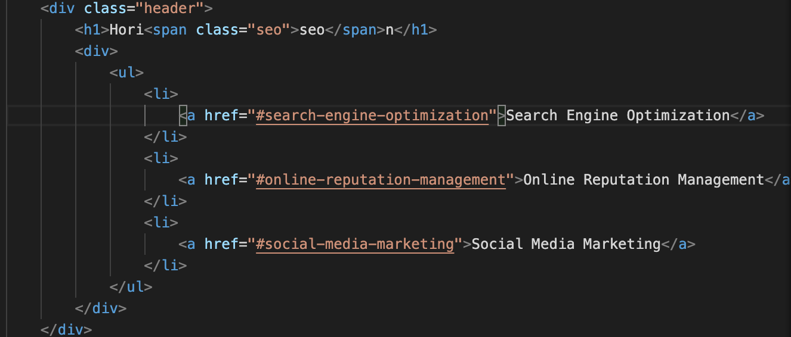

# Refactorization of Code for Horiseon Website
## Table of contents
* [Prerequisites](https://github.com/brianjunhyuplee/refactor-repo#prerequisites)
* [Objectives](https://github.com/brianjunhyuplee/refactor-repo#objective)
* [Process](https://github.com/brianjunhyuplee/refactor-repo#process)
* [Built-With](https://github.com/brianjunhyuplee/refactor-repo#built-with)
* [Deployed-Link](https://github.com/brianjunhyuplee/refactor-repo#deployed-link)
* [Authors](https://github.com/brianjunhyuplee/refactor-repo#authors)
* [License](https://github.com/brianjunhyuplee/refactor-repo#license)
* [Acknowledgements](https://github.com/brianjunhyuplee/refactor-repo#acknowledgments)
## Prerequisites:
* Computer with internet access
## Objective: 

Refactoring existing html and css files to _meet semantic tag guidelines_ and _identify potential accessibilty issues_

## Process:
**1.  Read provided HTML to identify potential issues**

The given code can be improved by applying semantic tags and alt on images


Semantic tags can make it easier for programmers to identify what segments of code control which parts of the HTML. Adding alt on images is mainly for for accessibility purposes. If the user's interface in unable to render the given image, the alt provides a description of the image sufficient for the user to understand what the image was supposed to be.

**2.  Apply fixes for the semantic tags**
1. For HTML

*Examples of nonsemantic tags:*
```bash
<div class="header">
<div class="content">
<div class="search-engine-optimization">
...
```
*Examples of semantic tag fixes:*
```bash
<header>
<main class="content">
<section class="search-engine-optimization">
...
```

2. For CSS

With the changes to the HTML file, some changes must be added to the CSS file to correspond accordingly.

*Examples of unfixed CSS classes:*
```bash
.header{
    ...
}
.header h1{
    ...
}
.footer{
    ...
}
.footer h2{
    ...
}
...
```
*Examples of fixed CSS classes:*
```bash
header{
    ...
}
header h1{
    ...
}
footer{
    ...
}
footer h2{
    ...
}
...
```
**3.  Apply fixes for alt on images**

*Example of images with no alt :*
```bash

```

*Example of fix :*
```bash

```

## Built With:
* [HTML](https://developer.mozilla.org/en-US/docs/Web/HTML)
* [CSS](https://developer.mozilla.org/en-US/docs/Web/CSS)

## Deployed Link:
* [Horiseon_Webpage](https://brianjunhyuplee.github.io/refactor-repo/)

## Author(s):
**Brian Lee**
* [GitHub](https://github.com/brianjunhyuplee)
* [LinkedIn](https://www.linkedin.com/in/brian-lee-559208187/)

## License:

This project is licensed under the [MIT-License](https://www.mit.edu/~amini/LICENSE.md)

## Acknowledgments:
* Jerome Chenette (Lead Instructor of UCB Bootcamp)
* Kerwin Hy (TA at UCB Bootcamp)
* Manuel S Nunes (Instructor at UCB Bootcamp)
* Roger Le (Instructor at UCB Bootcamp)